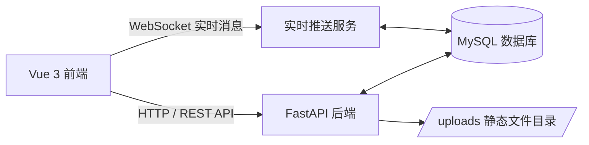

# 校园二手交易平台项目文档

## 1. 项目概述

校园二手交易平台是一个面向高校场景的全栈 Web 应用，主要用于解决校园内教材、生活用品、电子产品等闲置物品流转不畅的问题。系统以 `FastAPI + SQLAlchemy + Vue 3 + Vite + SQLite3` 为技术基础，围绕“发布、浏览、筛选、收藏、购买、私聊、通知、管理”八个核心环节构建完整业务闭环。

项目同时覆盖课程设计要求中的前端基础、Vue 组件化开发、FastAPI 接口开发、SQLAlchemy 数据建模、多表关联查询、分页查询、复杂条件筛选、响应式布局和前后端实时交互等关键能力点，适合作为 Web 编程技术课程的综合实践项目。

## 2. 项目目标

- 搭建一个功能完整、界面清晰、交互流畅的校园二手交易平台。
- 训练学生完成需求分析、数据库设计、接口开发、页面开发、联调测试与部署上线的完整流程。
- 强化多表关联、分页查询、关键词搜索、条件筛选、事务处理和权限控制等后端能力。
- 强化 Vue 页面组件化、路由控制、状态管理、表单验证和响应式布局等前端能力。
- 引导学生在真实业务场景中理解前后端分离开发、实时通信和系统化设计思维。

## 3. 技术架构

### 3.1 总体架构

系统采用典型的 B/S 架构，前端负责页面展示、交互处理和状态维护，后端负责业务逻辑、权限控制和数据库访问，MySQL 负责持久化存储。部分高频交互采用 WebSocket 实现实时推送。



### 3.2 后端技术

- `FastAPI`：提供高性能 REST 接口，适合快速构建课程项目后端。
- `SQLAlchemy`：负责 ORM 映射、查询构建、事务管理和关联关系处理。
- `PyMySQL`：连接 MySQL 数据库。
- `JWT`：实现登录鉴权和角色权限控制。
- `WebSocket`：实现私聊消息与通知的实时更新。
- `StreamingResponse`：用于导出平台统计报表 ZIP 文件。

### 3.3 前端技术

- `Vue 3`：构建页面视图和组件逻辑。
- `Vue Router`：管理页面路由和权限跳转。
- `Pinia`：管理用户登录状态、未读消息等全局状态。
- `Axios`：与后端接口通信。
- `Vite`：作为开发服务器和构建工具。
- `CSS`：完成整体视觉风格、响应式布局和页面美化。

### 3.4 数据存储

系统使用 SQLite 作为主数据库，上传图片保存在后端 `uploads` 目录中，并通过 `/uploads` 路径对外提供静态访问。

## 4. 系统功能

### 4.1 普通用户功能

1. 注册与登录
2. 个人信息查看与修改
3. 二手物品发布、编辑、删除
4. 物品列表分页浏览
5. 关键词搜索、分类筛选、价格筛选、发布时间筛选
6. 物品详情联表查看
7. 收藏与取消收藏
8. 我的发布、我的收藏
9. 购买商品并生成订单
10. 私聊卖家并实时收发消息
11. 查看系统消息与通知提醒

### 4.2 管理员功能

1. 仪表盘查看平台核心统计数据
2. 用户角色管理
3. 商品状态管理
4. 分类管理
5. 热门商品查看
6. 导出平台统计报表

### 4.3 课程加分功能

- 商品浏览量统计
- 热门商品推荐
- 图片上传
- 实时消息推送
- 消息未读角标提醒
- 仪表盘 ZIP 报表下载
- 浏览量会话去重

## 5. 功能模块说明

### 5.1 首页模块

首页展示全部商品、热门推荐、分类筛选和搜索入口。用户可以快速浏览商品卡片，查看商品名称、价格、成色、卖家信息和收藏状态。首页重点体现分页加载、条件筛选、响应式商品卡片布局以及热门推荐的优先展示。

### 5.2 商品详情模块

商品详情页用于展示商品完整信息，包括标题、价格、描述、分类、卖家、成色、地点、浏览量、图片列表和收藏状态。页面提供收藏、购买、发起私聊等操作入口，并支持同一浏览会话下的浏览量去重统计。

### 5.3 发布与编辑模块

发布页和编辑页采用同一套表单，支持填写标题、分类、价格、成色、地点、描述、上传图片等信息。系统会进行表单校验，避免出现空值、价格超范围或字段格式错误等问题。

### 5.4 收藏模块

收藏模块记录用户感兴趣的商品，用户可以在“我的收藏”中统一查看。收藏关系采用唯一约束，避免同一用户重复收藏同一商品。

### 5.5 购买与订单模块

用户可从商品详情页直接发起购买，系统会生成订单记录，并将商品状态更新为已售出。订单列表支持查看订单详情、发起会话和回溯交易记录。

### 5.6 私聊与通知模块

系统支持围绕某个商品或订单创建会话，买卖双方可以实时发送消息。未读消息、会话列表和通知中心会同步更新，前端通过 WebSocket 接收后端推送，减少刷新页面的频率。

### 5.7 管理后台模块

管理员后台采用仪表盘式设计，集中展示用户数、商品数、上架率、浏览量、收藏量、订单数、会话数、消息数、通知数和分类数量等核心指标。后台还包含用户管理、商品审核、分类管理、热门商品与报表下载功能。

## 6. 数据库设计

系统共使用 9 张核心数据表，围绕用户、商品、交易、沟通和通知五大业务域建立数据关联。

### 6.1 数据表总览

| 表名 | 作用 | 核心字段 |
|---|---|---|
| `users` | 用户基础信息与角色权限 | `username`、`email`、`nickname`、`password_hash`、`role`、`is_active` |
| `categories` | 商品分类 | `name`、`slug`、`sort_order`、`is_active` |
| `items` | 商品主表 | `title`、`description`、`price`、`condition`、`location`、`status`、`views`、`is_featured`、`seller_id`、`category_id` |
| `item_images` | 商品图片 | `item_id`、`url`、`sort_order` |
| `item_views` | 浏览记录去重 | `item_id`、`viewer_key` |
| `purchase_orders` | 购买订单 | `item_id`、`buyer_id`、`seller_id`、`amount`、`status` |
| `conversations` | 私聊会话 | `item_id`、`buyer_id`、`seller_id`、`last_message_preview`、`last_message_at`、`unread_buyer_count`、`unread_seller_count` |
| `chat_messages` | 聊天消息 | `conversation_id`、`sender_id`、`content` |
| `notifications` | 系统通知 | `user_id`、`kind`、`title`、`content`、`is_read`、`item_id`、`order_id`、`conversation_id` |
| `favorites` | 收藏关系 | `user_id`、`item_id` |

### 6.2 关键约束与关联

- `users.username` 唯一。
- `users.email` 唯一且可为空。
- `categories.name` 与 `categories.slug` 唯一。
- `items.price` 不能为负数。
- `favorites` 对 `user_id + item_id` 做唯一约束。
- `purchase_orders` 对 `item_id` 做唯一约束，确保一件商品只有一个订单。
- `conversations` 对 `item_id + buyer_id + seller_id` 做唯一约束，防止重复建会话。
- `item_views` 对 `item_id + viewer_key` 做唯一约束，实现浏览量去重。
- `items.seller_id`、`items.category_id`、`item_images.item_id`、`chat_messages.conversation_id`、`notifications.item_id` 等均通过外键关联主表。

### 6.3 数据库修改入口

当前仓库中与数据库直接相关的文件主要有 4 处：

| 文件 | 作用 | 何时修改 |
|---|---|---|
| `backend/mysql_init.sql` | MySQL 手工初始化脚本 | 改表结构、改字段、改初始数据时必须同步修改 |
| `backend/app/models.py` | SQLAlchemy ORM 模型 | 改运行时数据库模型时优先修改这里 |
| `backend/scripts/init_db.py` | ORM 自动建表脚本 | 如果要用 Python 方式自动建表，可在这里扩展初始化流程 |
| `backend/scripts/seed_data.py` | 示例数据脚本 | 调整默认账号、商品样例、收藏数据时修改这里 |

补充说明：

- 如果你只是修改数据库连接信息，例如账号、密码、主机、端口、库名，修改 `backend/.env` 和 `backend/.env.example` 即可，`backend/app/config.py` 会自动读取。
- 如果你修改了表字段、主键、外键或唯一约束，必须同时检查 `backend/app/models.py` 和 `backend/mysql_init.sql`，否则会出现“模型和数据库结构不一致”的问题。
- 如果你增加了示例数据或调整默认测试账号，通常还需要同步修改 `backend/scripts/seed_data.py`。
- 当前项目只有一个手写 SQL 文件，即 `backend/mysql_init.sql`；如果需要重新导入数据库，优先使用它。

## 7. 后端接口设计

后端统一采用 `/api` 前缀，接口返回 JSON 数据，部分管理员接口和实时接口也遵循统一鉴权规则。

### 7.1 认证接口

| 方法 | 接口 | 说明 |
|---|---|---|
| `POST` | `/api/auth/register` | 用户注册 |
| `POST` | `/api/auth/login` | 用户登录，返回 JWT |
| `GET` | `/api/auth/me` | 获取当前登录用户信息 |
| `PUT` | `/api/auth/me` | 修改个人信息 |

### 7.2 分类接口

| 方法 | 接口 | 说明 |
|---|---|---|
| `GET` | `/api/categories` | 获取分类列表 |
| `POST` | `/api/categories` | 新增分类（管理员） |
| `PUT` | `/api/categories/{id}` | 修改分类（管理员） |
| `DELETE` | `/api/categories/{id}` | 删除分类（管理员） |

### 7.3 商品接口

| 方法 | 接口 | 说明 |
|---|---|---|
| `GET` | `/api/items` | 商品分页列表、筛选、搜索 |
| `GET` | `/api/items/{id}` | 商品详情 |
| `POST` | `/api/items` | 发布商品 |
| `PUT` | `/api/items/{id}` | 编辑商品 |
| `DELETE` | `/api/items/{id}` | 删除商品 |
| `GET` | `/api/items/me/list` | 我的发布 |
| `GET` | `/api/items/recommendations/hot` | 热门推荐 |

### 7.4 收藏接口

| 方法 | 接口 | 说明 |
|---|---|---|
| `GET` | `/api/favorites` | 我的收藏 |
| `POST` | `/api/favorites/{item_id}/toggle` | 收藏/取消收藏切换 |

### 7.5 订单接口

| 方法 | 接口 | 说明 |
|---|---|---|
| `POST` | `/api/orders/purchase/{item_id}` | 购买商品 |
| `GET` | `/api/orders/me` | 我的订单 |

### 7.6 私聊接口

| 方法 | 接口 | 说明 |
|---|---|---|
| `GET` | `/api/chats/conversations` | 会话列表 |
| `POST` | `/api/chats/from-item/{item_id}` | 从商品创建会话 |
| `POST` | `/api/chats/from-order/{order_id}` | 从订单创建会话 |
| `GET` | `/api/chats/conversations/{conversation_id}` | 会话消息详情 |
| `POST` | `/api/chats/conversations/{conversation_id}/messages` | 发送消息 |
| `PUT` | `/api/chats/conversations/{conversation_id}/read` | 标记会话已读 |

### 7.7 通知接口

| 方法 | 接口 | 说明 |
|---|---|---|
| `GET` | `/api/notifications` | 通知列表 |
| `GET` | `/api/notifications/unread-count` | 未读通知数量 |
| `PUT` | `/api/notifications/{id}/read` | 标记单条通知已读 |
| `PUT` | `/api/notifications/read-all` | 全部标记已读 |

### 7.8 上传、统计与管理接口

| 方法 | 接口 | 说明 |
|---|---|---|
| `POST` | `/api/upload/images` | 上传商品图片 |
| `GET` | `/api/stats/dashboard` | 平台统计数据 |
| `GET` | `/api/admin/users` | 用户列表（管理员） |
| `PATCH` | `/api/admin/users/{user_id}/role` | 修改用户角色（管理员） |
| `GET` | `/api/admin/items` | 商品审核列表（管理员） |
| `PATCH` | `/api/admin/items/{item_id}/status` | 修改商品状态（管理员） |
| `GET` | `/api/admin/dashboard/export` | 导出仪表盘报表 ZIP |

### 7.9 实时通信接口

| 方法 | 接口 | 说明 |
|---|---|---|
| `WebSocket` | `/api/ws/updates?token=...` | 实时消息与通知推送 |

## 8. 前端页面设计

### 8.1 页面结构

| 页面 | 路由 | 说明 |
|---|---|---|
| 首页 | `/` | 商品浏览、搜索、筛选、热门推荐 |
| 商品详情 | `/items/:id` | 商品完整信息、收藏、购买、私聊 |
| 发布商品 | `/items/new` | 新建商品表单 |
| 编辑商品 | `/items/:id/edit` | 编辑商品表单 |
| 我的发布 | `/me/items` | 管理自己发布的商品 |
| 我的收藏 | `/me/favorites` | 查看收藏商品 |
| 我的订单 | `/me/orders` | 查看购买记录 |
| 私聊消息 | `/me/messages` | 会话列表与聊天窗口 |
| 消息提醒 | `/me/notifications` | 系统通知中心 |
| 登录 | `/login` | 用户登录 |
| 注册 | `/register` | 用户注册 |
| 管理后台 | `/admin` | 管理员仪表盘与管理功能 |

### 8.2 页面交互特点

- 商品列表支持分页与条件联动，筛选条件变化后可重新加载数据。
- 发布表单支持实时校验，避免提交非法价格和缺失字段。
- 商品详情页支持图片切换、收藏切换、购买和私聊发起。
- 私聊页面和通知页面支持 WebSocket 实时更新，无需频繁刷新。
- 管理后台采用仪表盘布局，便于快速查看平台整体运行情况。

## 9. 核心实现要点

### 9.1 登录鉴权与权限控制

系统使用 JWT 作为登录态凭证。用户登录后，前端将 token 保存在本地，并在请求头中携带。路由守卫会校验登录状态与管理员权限，避免未授权访问受保护页面。

### 9.2 分页与复杂筛选

商品列表接口支持按关键词、分类、价格区间、发布时间、状态等条件组合查询，同时返回分页信息，前端根据 `page`、`pages`、`total` 动态渲染分页器。

### 9.3 多表联查

商品详情页、订单页、会话页和管理后台均涉及多表联查，例如商品详情需要联查卖家、分类和图片，订单页需要联查商品和买卖双方，会话页需要联查商品、消息和未读状态。

### 9.4 浏览量去重

系统不再简单地“每刷新一次加一次”，而是通过 `item_views` 浏览记录表结合 `viewer_key` 做去重。这样可以避免同一会话内反复刷新导致浏览量虚高。

### 9.5 实时消息与通知

后端通过 WebSocket 向前端推送会话更新和通知变化。前端收到事件后，会同步刷新消息列表、通知列表和未读角标，从而实现接近即时的交互体验。

### 9.6 报表导出

管理员可以一键下载平台统计报表，导出的 ZIP 包中包含概览数据、分类分布、热门商品、用户和商品明细，以及 JSON 版汇总文件，便于课程验收和归档。

## 10. 项目目录结构

```text
D:\javaweb
├─backend
│  ├─app
│  │  ├─routers
│  │  ├─commerce.py
│  │  ├─config.py
│  │  ├─crud.py
│  │  ├─database.py
│  │  ├─main.py
│  │  ├─models.py
│  │  ├─realtime.py
│  │  ├─reporting.py
│  │  ├─schemas.py
│  │  └─security.py
│  ├─mysql_init.sql
│  ├─requirements.txt
│  ├─install_deps.bat
│  ├─start_backend.bat
│  └─uploads
├─frontend
│  ├─src
│  │  ├─api
│  │  ├─components
│  │  ├─router
│  │  ├─stores
│  │  ├─styles
│  │  ├─utils
│  │  └─views
│  ├─package.json
│  └─vite.config.js
└─README.md
```

## 11. 环境要求

- Python 3.11 及以上
- Node.js 18 及以上
- MySQL 8.0 及以上

## 12. 系统运行步骤

### 12.1 数据库初始化
1. 修改backend\.env中的数据库账号密码。
2. 登录 MySQL或Navicat。
2. 执行 `backend/mysql_init.sql`。
3. 确认数据库 `campus_market` 已创建，表结构和示例数据已导入。

### 12.2 后端启动

```bash
cd backend
python -m pip install -r requirements.txt
python -m uvicorn app.main:app --reload --host 0.0.0.0 --port 8000
```

Windows 也可以直接运行：

- `backend\install_deps.bat`
- `backend\start_backend.bat`

### 12.3 前端启动

```bash
cd frontend
npm install
npm run dev
```

前端默认通过 Vite 代理访问后端接口和上传资源。

## 13. 默认测试账号

> 以下账号用于项目演示和测试。

- 管理员：`admin / admin123`
- 普通用户：`alice / alice123`
- 普通用户：`bob / bob12345`

## 14. 测试与验收建议

### 14.1 基础功能测试

- 注册新用户并完成登录。
- 发布一条商品，检查是否进入首页列表和“我的发布”。
- 切换分页、关键词、分类和价格区间，确认筛选结果正确。
- 打开商品详情，查看图片、卖家信息和收藏按钮状态。
- 收藏和取消收藏同一商品，确认状态同步。

### 14.2 交易链路测试

- 使用普通用户购买商品，确认订单生成且商品状态变为已售出。
- 从商品页或订单页发起私聊，确认会话可以正常创建。
- 发送消息后检查对方页面是否实时接收。
- 检查通知中心与未读角标是否同步更新。

### 14.3 管理功能测试

- 使用管理员账号进入后台。
- 检查用户角色修改是否生效。
- 修改商品状态后确认列表刷新。
- 新增、编辑和删除分类是否正常。
- 点击“下载报表”后确认 ZIP 文件可正常下载。

## 15. 可扩展方向

- 增加商品评论与评分系统。
- 增加订单取消、交易确认和售后反馈流程。
- 增加更完整的消息搜索和会话置顶功能。
- 增加后台图表可视化，如折线图、柱状图和饼图。
- 增加按日/周/月统计商品发布量和交易量的趋势分析。
- 增加移动端适配优化和 PWA 支持。

## 16. 项目总结

校园二手交易平台将课程中涉及的前端基础、Vue 组件化、FastAPI 接口开发、SQLAlchemy 数据库操作、实时通信、文件上传和后台管理整合到一个统一的业务场景中，既能体现系统开发的完整性，也能体现学生对全栈开发流程的掌握程度。

该项目适合用于课程设计展示、答辩演示和实验报告整理。通过本项目，学生可以将“会写页面、会写接口、会查数据库”进一步提升到“能设计系统、能拆分模块、能联调部署”的层次。
